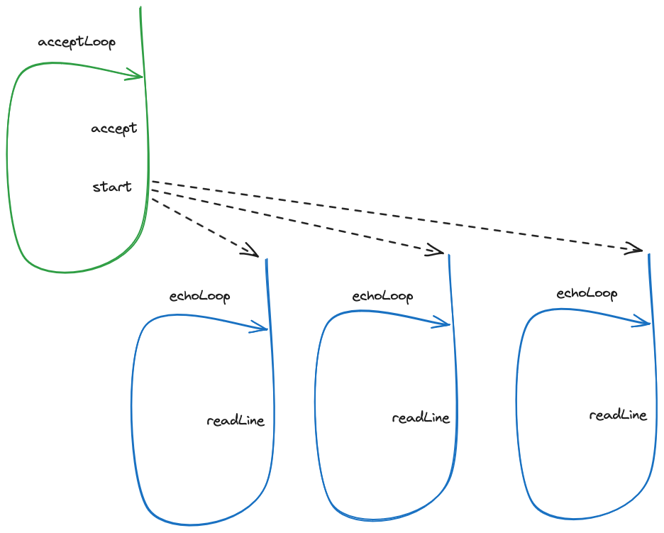

= A motivating example

To motivate the use of threads, we are going to implement a little TCP-based echo server - an application that accepts TCP connections from remote clients and that echoes all the lines received on each accepted connection.
An echo server may not seem very useful, however it will allow us to introduce the concepts and challenges related to multi-threading in a more concrete yet simple scenario.
An an echo server is just the starting point for more complex and useful server systems, such as an instant messaging server or a database management system.

== Auxiliary APIs

For this TCP-based server we will use a set of auxiliary APIs (Application Programming Interface) that are not directly associated to concurrent programming, but that are needed to build the server.

=== Socket classes

The sockets classes are the interface for network communication.

The link:https://docs.oracle.com/en/java/javase/21/docs/api/java.base/java/net/Socket.html[`Socket`] class represents the endpoint of a connection between two machines.
It can be used to establish a connection to a remote endpoint as well as to send and receive bytes through that connection.

The link:https://docs.oracle.com/en/java/javase/21/docs/api/java.base/java/net/ServerSocket.html[`ServerSocket`] class represents the mechanism that accepts connections on a server system.

Note that on a client-server design:

* _server_ programs *listen* and *accept* connections from _clients_, on a given address and port. 
For these listening and accepting activities, a JVM-based server can use `ServerSocket` class.
* _client_ programs *establish* connections to _servers_, by connecting to the server's address and port. 
For this connection activity, a JVM-based client can use the `Socket` class.

After a connection is established between a client program and a server program, both will use a `Socket` instance to manage, read, and write from that connection.

=== Streams

The JVM classical abstractions to deal with streams of bytes, namely the ones communicated via a TCP connection, are the:

* link:https://docs.oracle.com/en/java/javase/21/docs/api/java.base/java/io/OutputStream.html[`OutputStream` interface].
Provides methods to writing bytes or byte arrays into the stream (e.g. the TCP connection).
* link:https://docs.oracle.com/en/java/javase/21/docs/api/java.base/java/io/InputStream.html[`InputStream` interface].
Provides methods to read bytes or byte arrays from the stream (e.g. the TCP connection).

=== Readers and Writers

The `OutputStream` and `InputStream` interfaces provide a way to write and read *bytes*.
To write and read strings (i.e. sequences of *characters*), the `Writer` and `Reader` interfaces should be used instead.
The Kotlin standard library (as well as the Java standard library) provides ways to obtain:

* A `Writer` instance _on top of_ an `OutputStream` instance.
* A `Reader` instance _on top of_ an `InputStream` instance.

=== Logging

_Logging_ is the practice of creating and outputting a string every time something relevant happens during the execution of a program.
The main goal is to provide visibility into what is happening in a program, both for real-time or à-posterior analysis of such execution.

A common way of issuing these log messages is by using the _Simple Logging Facade for Java_ (SLF4J) library.

== A single-threaded server

We will start our journey by creating a single-threaded server 
(link:../../code/jvm/src/main/kotlin/org/pedrofelix/concurrency/course/apps/tcpserver/EchoServer0SingleThreaded.kt[source code]).

[source, kotlin]
----
include::../../code/jvm/src/main/kotlin/org/pedrofelix/concurrency/course/apps/tcpserver/EchoServer0SingleThreaded.kt[]
----

* The `run` function creates a `ServerSocket`, i.e., an object that is able to listen and accept connections, and binds it to a listening address and a port.

* The `acceptLoop` function calls `accept` over the `ServerSocket` instance, _blocking_ until a remote connection is established to the server. 
When that happens, `accept` will return a `Socket` instance, representing the server endpoint of that connection. 
After the `accept` call, the `acceptLoop` function calls `echoLoop` to echo all lines received through this socket.

* The `echoLoop` function creates a reader and a writer on top of the socket input and output, presents a welcome message, and waits for a line to be received.
Then it simply writes the line back into the socket, in upper case.
The loop ends when the `readLine` returns `null`, meaning the socket was closed, or when the `exit` line is sent by the remote client.

* When the `echoLoop` function returns, the control flow goes back to the `acceptLoop` function, to listening and accepting a new connection.

IMPORTANT: run this server and test it using a TCP/IP client, such as link:https://linux.die.net/man/1/nc[nc]. Use more than one client instance simultaneously connected to the server (e.g. by using multiple shells).

An important limitation of the previous implementation is that it can only handle one connection at a given time.
A new connection is accepted only after the `echoLoop` function returns, i.e., after the previous connection is terminated.
This is a consequence of having only a single control flow, which is either accepting lines from a connection or accepting new connections, but not both.

== A multi-threaded server

A solution to the previous limitation is to create multiple control flows via the creation of multiple threads:

* A single thread will be accepting new connections.
* _N_ threads will be echoing received lines from _N_ connections - what is commonly called a _thread per connection_ design.

The _thread_ is the mechanism to define and execute a new flow of control, i.e. a new sequence of statements, in the _same_ program.

The multi-threaded server (link:../../code/jvm/src/main/kotlin/org/pedrofelix/concurrency/course/apps/tcpserver/EchoServer1ThreadPerClient.kt[source code]) implementation uses the ability to create and start multiple threads, provided by the JVM platform.

[source, kotlin]
----
include::../../code/jvm/src/main/kotlin/org/pedrofelix/concurrency/course/apps/tcpserver/EchoServer1ThreadPerClient.kt[]
----

The main changes are on the `acceptLoop` function.

* First, a `threadBuilder` is created before the cycle starts. This will allow us to create threads.
* Then, after receiving a new `socket` from the `accept` call, the function does

[source, kotlin]
----
val socket = serverSocket.accept()
(...)
val newClientId = ++clientId
threadBuilder.start {
    logger.info("created and started thread to handle client {}", newClientId)
    echoLoop(socket, newClientId)
}
----

instead of

[source, kotlin]
----
val socket = serverSocket.accept()            
echoLoop(socket, ++clientId)
----

The `threadBuilder.start` call will create a new thread, which will execute the passed in function, namely the `echoLoop` call, _simultaneously_ with thread running the `acceptLoop`.

We now have two control flows, i.e., two threads:

* The previously existing thread, waiting for a new connection.

* The newly created thread, waiting for a line from on the previously accepted connection.

IMPORTANT: The call to `threadBuilder.start` returns **before** the code in the passed in block is run, namely the `echoLoop` function.

When a second connection is accepted, then a third thread is created to handle this new connection.
This design is designated by _thread-per-connection_, because there will be a thread dedicated to each connection.

.Multi-thread design
[#img-multi-threaded-design]

At first, this multi-threading thing seems rather easy: we just call `start` on a thread builder and that's it.
However, this is very far from the truth: by having multiple threads in the same program, sharing mutable data, we just created a whole new class of problems and challenges.
The concurrent programming course main goal is to provide the knowledge and the skills to create correct programs that use more than one thread.

As a appetizer to what follows, consider the following code

[source, kotlin]
----
val newClientId = ++clientId
threadBuilder.start {
    logger.info("created and started thread to handle client {}", newClientId)
    echoLoop(socket, newClientId)
}
----

A curious mind may be thinking why `newClientId` is required. 
Namely, why isn't `clientId` directly used on the function passed in to `start`?

[source, kotlin]
----
++clientId
threadBuilder.start {
    logger.info("created and started thread to handle client {}", clientId)
    echoLoop(socket, clientId)
}
----

The answer is simple: the former design using `newclientId` is correct, while the latter design is incorrect.
And by incorrect we mean that there isn't the guarantee that `echoLoop` will always be called with distinct incrementing client IDs.

== The road ahead

This simple example introduces some interesting challenges that we will address in the Concurrent Programming course.

=== Data Synchronization

Suppose we want to maintain a counter with all active connections. 
That counter can be incremented in the thread running `acceptLoop`, however probably needs to be decremented in each of the threads running `echoLoop`.
This introduces the problem of a data variable mutated and read by more than one thread.
This will require the use of proper _data synchronization_ to ensure correctness.

=== Control Synchronization

Another feature that we may want to add is to limit the number of handled connections on any moment.
That requires the call to `serverSocket.accept` to be delayed until the handling of a connection ends, when that number is reached.
This introduces the problem of coordination between threads, also called _control synchronization_, where threads _wait_ for certain conditions to be true.

=== Virtual threads and Kotlin coroutines

A thread-per-connection design requires as many threads as connections. 
However threads have a computational cost that is much higher than connections, namely the required memory.
I.e. it is possible to have much more connections that threads.
Virtual threads and Kotlin coroutines are two ways of dealing with this problem, which we will address in this course.
