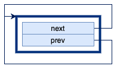
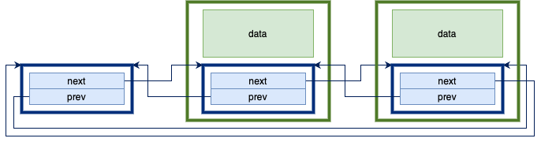
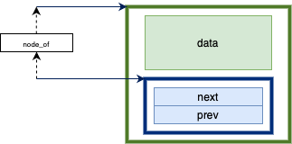
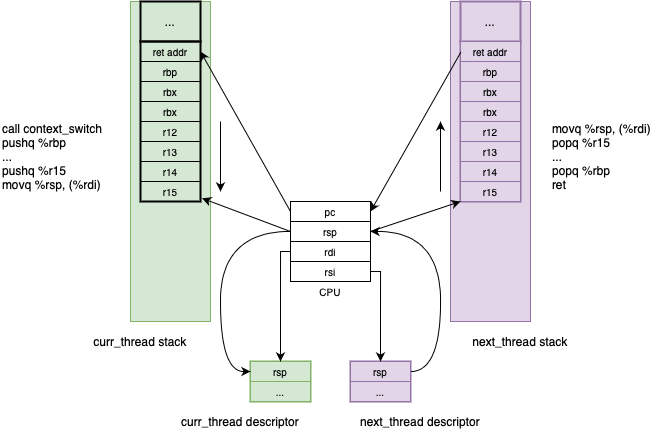
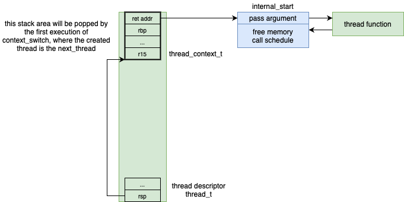

= _uthreads_ - User Mode Cooperative Threads

== Introduction

_uthreads_ is a small native library, developed with the AMD64 (x86-64) and C languages, for illustrating how multi-threading can be achieved in user mode.
It is mainly intended as a pedagogical tool, providing a way for students to see an example of how some important concepts can be implemented in practice, namely:

* What is a _thread context_ and what is a _context switch_, i.e., how can a thread be suspended and resumed.
* What is _scheduling_ and how it can be performed.
* What are the principal thread states and how they are represented in the _uthread_ data structures.
* How is non-busy control synchronization achieved.

== Development and execution environment

The _uthreads_ system was designed for execution in a Linux environment. using the AMD64 CPU architecture.
A way to have such an environment on non-Linux systems (e.g. Windows or macOS) is to use:

* Docker Desktop
* Visual Studio Code with the *Dev Containers* extension - https://marketplace.visualstudio.com/items?itemName=ms-vscode-remote.remote-containers

The *Dev Containers* extensions allows Visual Studio Code to run in _client-server_ mode, where:

* Most of the Visual Studio Code components will run inside a container, namely the file-system access.
* The Visual Studio Code user interface will still be running in the host system (e.g. Windows or macOS).

The configuration for this _client-server_ mode is defined inside the `.devcontainer` folder and includes:

* The `devcontainer.json` file.
* The `Dockerfile` file.

The development environment is based on the https://mcr.microsoft.com/en-us/product/devcontainers/cpp/about[mcr.microsoft.com/vscode/devcontainers/cpp:0-debian-11] image, which already includes the tools required for C and C++ based application development.

== _uthreads_ components

=== Lists

A significant part in the _uthreads_ operation is moving threads between lists.
The `list.h` and `list.c` files define functions to create and operate over double-linked _intrusive_ lists, with _sentinel_ nodes.
An _intrusive_ double-linked list includes the next and previous pointers in the data structure itself, so that each list element only requires a single contiguous block of memory.

The `list_entry_t` structure contains the next and previous pointers. 
The data items managed by the list need to contain a field of this type.
Most of the functions are self-documenting (e.g. `list_init` initializes a list).

.An empty list.
[#img-empty-list]

.List with two data items.
[#img-list-with-two-data-items]

The `node_of` is probably the least obvious part of this list. 
It returns the pointer to the data node, given the type of the data node and the pointer to the `list_entry_t` field inside the data node.

.`node_of` macro.
[#img-node-of]

`uthread` uses these lists mainly to store thread descriptors.
Thread lifecycle events typically envolve moving thread descriptors in and out of lists.

=== Data structures

The _uthreads_ library uses two main data structure types.
The first is `thread_t`, also called the _thread descriptor_, and contains information about a single thread,
including what is needed to resume its execution if it is suspended.
As we will see, this information is a pointer to the top of its stack.

.Thread descriptor
[source, c]
----
// in uthread.c
struct uthread
{
  // pointer to the thread's stack
  uint64_t rsp;

  // the function that will be run by the thread when the thread starts
  start_routine_t start;

  // the argument to the start function
  uint64_t arg;

  // because this uthread structure will be stored in lists
  list_entry_t list_entry;
};

// in uthread.h
typedef struct uthread uthread_t;
----

The second data structure is `uthread_context_t` and defines the layout of the thread's saved context.

.Thread context
[source, c]
----
// in uthread.c
typedef struct uthread_context
{
  uint64_t r15;
  uint64_t r14;
  uint64_t r13;
  uint64_t r12;
  uint64_t rbx;
  uint64_t rbp;
  void (*func_addr)();
} uthread_context_t;
----

=== Global variables

The _uthreads_ library uses the following global variables:

* The `thread_running` points to the descriptor of the single _running_ thread. 
* The `queue_ready` contains the descriptors of all _ready_ threads.
* The `thread_main` points to the descriptor of the main thread. The main thread represents the execution flow where the _uthreads_ system was initialized.

=== Functions

=== Context switch [[sec_context_switch]]

One of the main components of the _uthreads_ library is the `context_switch` function, responsible for switching the execution flow between two threads, represented by their thread descriptors.
This function suspends the execution of the running thread, whose descriptor needs to be provided as the first argument, and resumes the execution of the thread provided as the second argument.

.`context_switch` function
[source, c]
----
void context_switch(uthread_t *curr_thread, uthread_t *next_thread);
----

This function is written in assembly language and will be called from code written in the C language.
Due to this, we need to consider the link:https://refspecs.linuxfoundation.org/elf/x86_64-abi-0.99.pdf[C language calling convention for AMD64], namely:

* The way arguments are passed in, which will be the `rdi` and `rsi` for the first two arguments representable using 64 bits. That is, `curr_thread` will be passed in on `rdi` and `next_thread` will be passed in on `rsi`.

* The registers that must be preserved by the called function (i.e. the callee), which are `rbx`, `rbp`, `rsp`, and `r12` to `r15`.

Note that the program counter of the calling function is automatically saved on the stack by the execution of the `call context_switch` instruction.

The `context_switch` starts by pushing into the stack all registers that must be preserved by the callee function, except for `rsp`.
At the end of this, the stack for the current thread will look like this.

.Stack of the current thread, after `context_switch` saves the registers.
[#img-uthreads-curr-thread-stack]

The `rsp` register is then saved in the thread descriptor.
This will allow us to recover its value from the thread descriptor when switching back to the current thread.
If the `rsp` was only stored in the stack it would be impossible to recover it in the future, because we wouldn't know where the top of the stack for this thread would be.

Saving the `rsp` register into the current thread descriptor completes the saving of the current thread's context.
The next step is to restore the context for `next_thread`.
In order to do so, we need to first answer the following question: where is this context and what is its shape?

* If `next_thread` already ran before, then it execution was suspended due to a `context_switch` execution (where it was the running thread) and therefore its context is saved on its own stack, exactly as shown on xref:img-uthreads-curr-thread-stack[xrefstyle=short].

* If `next_thread` never ran before, then `context_switch` didn't yet preserved its context. However, we can make sure that thread creation initializes the thread stack with that exact same structure. This will allows us to write the restore part of `context_switch` without needing to know if `next_thread` already ran or not. Independently of that, its top of stack will have the same structure.

Using the above observations, the restore part of `context_switch` is the inverse of what was done in the first part:

* Move into the `rsp` register the value that was preserved in the thread descriptor.

* Pop all saved registers from stack.

* Return to the function that called `context_switch` when `curr_thread` was switched out of execution, or the thread's entry point if the thread never ran before.

.Context switch.
[#img-uthreads-context-switch]

The complete code for the `contex_switch` function is

.`context_switch` function
[source, c]
----
/* 
 * void context_switch(uthread_t *curr_thread, uthread_t *next_thread);
 *
 * Full context switch, saving the current thread context
 *  - %rdi has curr_thread
 *  - %rsi has next_thread
 */
context_switch:
    // suspend curr_thread ...
    // ... by saving the registers that aren't saved by the C compiler generated code 
	pushq %rbp
	pushq %rbx
	pushq %r12
	pushq %r13
	pushq %r14
	pushq %r15

    // ... %rsp is the only one that cannot be saved in the stack
    //     so we save it in the curr_thread descriptor
	movq %rsp, (%rdi)
	
    // resume next_thread ...
    // ... by loading the th1 stack from the th1 descriptor
	movq (%rsi), %rsp
	
    // ... and restoring the saved registers when next_thread was suspended
	popq %r15
	popq %r14
	popq %r13
	popq %r12
	popq %rbx
	popq %rbp
	
    // ... returning to the point on next_thread that called context_switch
	ret
----

==== _uthreads_ initialization

The `ut_init` function initializes the _uthreads_ system.
The main thing performed by this function is the `queue_ready` initialization, which will start empty.

==== Thread creation

The `ut_create` function creates a new thread and adds it to the `queue_ready`.
It receives a pointer to the function defining the thread execution and an argument to pass to it.

.`ut_create` function
[source, c]
----
typedef void (*thread_function_t)(uint64_t);
uthread_t *ut_create(thread_function_t thread_function, uint64_t arg)
----

This function starts by allocating space for two important things: the thread descriptor and the thread stack.
The current implementation uses a single block of memory to contain both things: the descriptor will be located at the block lower address;
the stack will start from the block higher address, since the stack grows downward.

The `ut_create` function then initializes the top of the stack _as if_ a `context_switch` had run. 
As described in the <<sec-context-switch, `context_switch` section>>, this will be assumed when the `context_switch` runs.
For that, a `uthread_context` structure is mapped into the top end of the stack.

.Thread stack and descriptor after thread creation.
[#img-uthreads-thread-create]

The first `context_switch` that switches execution into the created thread will use that initialized context.
Specifically, the `ret` instruction executed at the end of the `context_switch` will jump the processor execution to the address in `ret_addr`.
At first sight this could be the thread's entry point address.
However, this `ret_addr` will instead point to `internal_start`, which is a wrapper on top of the thread function.
This wrapper will be responsible for:

* Calling the thread's entry point, passing in the argument defined on the `ut_create` call.
* When the thread finishes execution, freeing the allocated memory, and scheduling the execution of a different thread.

==== Scheduling

The `schedule` function is responsible to select the next thread to run and switch the execution into it.

* The next thread to run will be the one at the head of the _ready queue_, that is, the thread that is in the ready state longer.

* Call `context_switch`, from the current thread into that next thread; using and updating the `thread_running` global variable.

.`schedule` function
[source, c]
----
void schedule()
{
  uthread_t *next_thread = list_is_empty(&queue_ready)
                               ? thread_main
                               : node_of(list_remove_head(&queue_ready), uthread_t, list_entry);
  if (next_thread == thread_running)
  {
    // no context is needed because next_thread is already running
    return;
  }
  uthread_t *current = thread_running;
  thread_running = next_thread;
  context_switch(current, next_thread);
}
----

If `queue_ready` is empty, then there aren't more threads, and the _uthreads_ system terminates by switching back to the `thread_main.`
This results in the `ut_run` function returning.

Note that the we can only conclude that an empty `queue_ready` means that there aren't more threads because this version of the _uthreads_ system only has two possible thread states: running and ready.

=== Summary

After going through all the implementation details it is useful to take a step back and summarize the essence of this threading system:

* A way to suspend and resume threads, implemented by the `context_switch` function.
* A way to represent threads as data, namely pass them to functions and store them in lists.
* A way to store all the threads that are ready to run but aren't running, i.e. the `queue_ready`.
* A way to select the most appropriate thread to run at a given moment and resume its execution, called the schedule. _uthreads_ uses a simple _first in first out_ scheduling policy, however it is not hard how other scheduling policies, namely based in thread priorities could be implemented.

It is noteworthy to observer that in _uthreads_, any thread is only suspended when it explicitly calls a function that triggers such suspension.
There isn't any external entity that can forcefully suspend a thread.
Systems that have this property are called _cooperative_.
The name comes from the fact that in order for multiple threads to execute, they need to cooperate by suspending themselves.

_Preemptive_ multi-threads systems, on the other hand, can forcefully suspend a thread at any point of its execution.
One of the mechanisms that allows for this are _processor interrupts_.

== Adding support for thread joining

The second _uthreads_ version, named `uthreads-1-join` adds a form of _control synchronization_, allowing a thread to wait for another thread to terminate.
This is implemented by the `void ut_join(uthread_t *thread);` function, 
which suspends execution of the currently running thread until the thread pointed by `thread` terminates.
This wait is not _active_ or _budy_: the waiting thread will not hold the CPU and query if the other thread terminates.
Instead, the wait will be _passive_, also called _non-busy_: the waiting thread will be suspended, not running and also not in the ready state, while the condition that it is waiting for is not true.

Adding support for this type of control synchronization requires some changes to the _uthreads_ system.
First, each thread descriptor will now have a `joiners` list to hold all the descriptors of the threads waiting for the first thread to terminate.
The `ut_join` function will add the currently running thread descriptor to that list and then perform a schedule.

Another required change is a consequence of the thread descriptor needing to outlive the thread lifetime.
Due to this, the thread's descriptor memory block will be distinct from the thread's stack memory block:

* `ut_create` allocates two memory blocks, one for the descriptor and another for the stack.
* When a thread terminates, only the stack memory block is automatically freed.
* The freeing of the thread descriptor needs to be explicitly performed by calling a new function - `ut_free`.

Finally, the thread termination code needs to move all the waiting threads from the `joiners` list to the ready list (i.e. `queue_ready`).

So when a thread `t1` wants to wait until the termination of a non-terminated thread `t2`, it puts its own descriptor in the `t2` `joiners` list and calls `schedule``.
After this call:

* `t1` will not be in the _running_ state because it called `schedule`.
* `t1` will not be in the _ready_  state because it is not in the `queue_ready`.

Instead, `t1` will be in a _non-ready_ state, waiting for some condition to be true.
During that wait, `t1` doesn't occupy the processor (not _running_) and is also not eligible to be run (not _ready_).

When will `t1` be eligible to run again, i.e., when will `t1` transition to the _ready_ state?
The waiting condition is `t2` having terminated, so it is `t2` responsibility to move `t1` out of its `joiners` list to the `queue_ready` list, just before `t2` terminates.

This illustrates the lifecycle of a control synchronization:

* where a `t1` thread adds itself to a queue associated to the waiting condition, and then promotes a context switch.
* where another `t2` thread detects that the condition is true and moves `t1` to the `queue_ready`.

Two important observations emerge from this:

* Control synchronizations as moving threads to data structures that represent the waiting condition, while the condition is not true, and then back to the ready queue when the condition is true.
* The responsibility of moving a waiting thread to the ready queue is not of the waiting queue but instead of the thread that make the condition become true.

== Adding support for I/O operations

The third _uthreads_ version we are going to analyze, named `uthreads-2-sockets`, adds support for I/O-based control synchronization. 
It illustrates the interaction between a threading system and an I/O system.
The end goal is to allow threads to perform I/O operations, such as accepting an inbound connection or reading bytes from a socket, while _suspending their execution_ until the operation is not completed.

To achieve this purpose we will need to use a way to perform I/O operations that don't block the operating system thread where the _uthreads_ system is running.
For that purpose, we will the Linux's link:https://man7.org/linux/man-pages/man7/epoll.7.html[_epoll_ (event polling) API].

=== The _epoll_ Application Programming Interface

In Linux, both sockets and server sockets are represented by _file descriptors_, obtained by calling the link:https://man7.org/linux/man-pages/man2/socket.2.html[socket] function.
Linux also allows socket operations to be non-blocking, meaning that a call to perform them will:

* Do the operation and return success, if the operation can be completed immediately (e.g. a socket read already has bytes available), .
* Otherwise, return information that the operation cannot be completed immediately (link:https://man7.org/linux/man-pages/man3/errno.3.html[`EAGAIN` and `EWOULDBLOCK`])

A file descriptor is configured this way by link:https://man7.org/linux/man-pages/man2/fcntl.2.html[setting the `O_NONBLOCK` control flag] on it.

This raises the question of how can a program know that a given operation can be performed successfully.
The _epoll_ mechanism is one of the answers to this question provided by the Linux Operating System, and it is based in the following concepts:

* An _epoll set_ (also called an interest list_), which is a set of file descriptors (e.g. socket descriptors) and associated operations (e.g. reads), that a program wants to know the status of.
* An API to create an _epoll set_, and manage the file descriptors and operations managed by the _epoll set_.
* A way to query if any operation can be performed successfully.

=== Changes to _uthreads_

The changes to the _uthreads_ core functionality, present in the `uthreads.c` file, are not major.
Instead, the most significant additions are in the new `sockets.c` file, containing the integration between the Linux socket operations and _uthreads_.

The interface between the `uthreads.c` core and the new `sockets.c` functionality is done by the following functions:

* `sockets.c` uses the functions:
  ** `move_running_thread_to_list` when it needs to suspend the running thread and store it in an internal list.
  ** `move_head_thread_to_ready` when it needs to move a thread from an internal list into the ready queue.

* `uthreads.c` uses the function `sockets_move_to_ready` to move all the threads that can perform socket operations back into the ready queue.

==== The sockets subsystem

The `sockets.c` and `sockets.h` expose public functions to:

* Initialize and close the sockets subsystem.

* Create and close server sockets, as well as accept incoming connections on those instances.

* Create and close sockets, as well as read and write bytes on those instances.

Internally, each socket instance contains the associated file descriptor and a list with the threads waiting to perform an operation on the instance.
In addition, the file descriptor is configured to work in non-blocking mode and is added to a global _epoll_ instance, managed by the sockets subsystem.

Every time a _uthread_ performs an operation over a server socket or socket instance, the following happens:

* The sockets function is called on the underlying file descriptor, configured to work in non blocking mode.
* If that call is successful, then the overall operation is complete and the calling _uthread_ continues it execution.
* Otherwise, the running _uthread_ is moved to the socket instance list and a _uthreads_ schedule is performed.
  ** Placing the running _uthread_ in the socket list allows the socket subsystem to know which threads are waiting on which sockets.
  ** The _uthreads_ schedule is required because the running _uthread_ doesn't have the conditions to keep running and must be suspended.

On the other hand, on each schedule operation, the _uthreads_ core functionality asks the sockets subsystem to check if there are I/O operations ready to be performed.
The sockets subsystem then uses the _epoll_ functionality to discover the socket instances that are ready to be used and moves all the associated threads to the _uthread_ ready queue.
 
This description skips some important details on how _epoll_ is used, however it is enough to provide an intuition of how _control synchronization_ with the I/O subsystem can be implemented.
Similarly to the previous _threads_ version, where the join function was added, supporting I/O based _control synchronization_ requires:

* Threads that don't have the conditions to continue the execution to store their descriptors in a data structure and suspend themselves.
* A way to determine that these conditions are now true and move the waiting threads into the ready queue.
